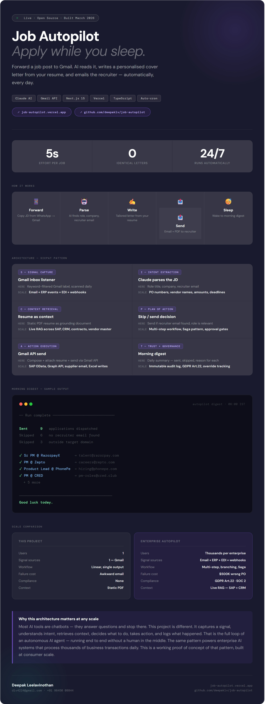

# Job Autopilot — Apply While You Sleep


> An AI autopilot that reads job posts, writes personalised cover letters, and emails recruiters — fully automatically.

[](https://job-autopilot.vercel.app)
[](https://github.com/deepaklv/job-autopilot)
[](https://anthropic.com)
[](https://nextjs.org)
[](https://vercel.com)

---

## The problem

Every job application requires the same painful sequence — copy the JD, open a doc, write a cover letter, find the recruiter email, attach your resume, send. Multiply that by 40 applications and you have lost a full working week to admin.

## The solution

Forward a job post to Gmail. Everything else is automatic.

---

## How it works

```
📱 Forward JD          🤖 AI parses            ✍️ AI writes
to Gmail        →      role, company,    →      tailored cover
                       recruiter email          letter from resume

📤 Auto-sends          😴 You sleep
email + resume  →      wake to morning
to recruiter           digest
```

---

## By the numbers

| Metric | Value |
|---|---|
| Your effort per application | 5 seconds |
| Identical cover letters sent | 0 |
| Runs automatically | 24/7 |
| Jobs handled per email | 10+ |

---

## Architecture — SICPAT pattern

This project implements the same six-layer architecture used in enterprise AI autopilot systems — at consumer scale.

| Layer | This project | Enterprise scale |
|---|---|---|
| **S — Signal capture** | Gmail keyword filter, scanned daily | Email + ERP events + EDI + webhooks |
| **I — Intent extraction** | Claude extracts role, company, recruiter email | PO numbers, vendor names, amounts, deadlines |
| **C — Context retrieval** | Static PDF resume as grounding document | Live RAG across SAP, CRM, contracts, vendor master |
| **P — Plan of action** | Send if recruiter email found and role is relevant | Multi-step workflow, Saga pattern, approval gates |
| **A — Action execution** | Compose + attach + send via Gmail API | SAP OData, Graph API, supplier email, Excel writes |
| **T — Trust + governance** | Daily digest — sent, skipped, reason for each | Immutable audit log, GDPR Article 22, override tracking |

> Same six-layer architecture. Different stakes. The gap between a cover letter sent to the wrong recruiter and a purchase order sent to the wrong vendor — that gap is the enterprise product problem.

---

## Safety features

- **Sends only when recruiter email is explicit** — never guesses, never sends blind
- **Filters irrelevant roles** — skips jobs outside your target domain automatically
- **Full transparency** — morning digest shows exactly what sent, skipped, and why
- **Handles bulk forwards** — forward 10 jobs at once, it splits and processes each individually

---

## Morning digest — sample output

```
── Autopilot digest · 06:00 IST ────────────────

Sent      9   applications dispatched
Skipped   6   no recruiter email found
Skipped   3   outside target domain

✓ Sr PM @ RazorpayX       → talent@razorpay.com
✓ PM @ Zepto              → careers@zepto.com
✓ Product Lead @ PhonePe  → hiring@phonepe.com
✓ PM @ CRED               → pm-roles@cred.club
  + 5 more sent

────────────────────────────────────────────────
Good luck today.
```

---

## Tech stack

- **AI** — Claude API (Anthropic) for JD parsing and cover letter generation
- **Email** — Gmail API with OAuth 2.0
- **Framework** — Next.js 15 (App Router)
- **Deployment** — Vercel with auto-cron
- **Language** — TypeScript

---

## Setup

### Prerequisites
- Node.js 18+
- Anthropic API key
- Gmail OAuth credentials

### Installation

```bash
git clone https://github.com/deepaklv/job-autopilot.git
cd job-autopilot
npm install
```

### Environment variables

Copy `.env.local.example` to `.env.local` and fill in your credentials:

```bash
cp .env.local.example .env.local
```

```env
ANTHROPIC_API_KEY=your-anthropic-api-key
GMAIL_CLIENT_ID=your-gmail-client-id
GMAIL_CLIENT_SECRET=your-gmail-client-secret
GMAIL_REFRESH_TOKEN=your-gmail-refresh-token
```

### Run locally

```bash
npm run dev
```

---

## Your effort

1. Forward a job post to Gmail
2. Gmail auto-labels it via keyword filter
3. Done. Everything else is automatic.

---

## Built by

**Deepak Leelavinothan** — Senior Product Manager, AI Products

- 17 years building enterprise SaaS and AI products
- Built agentic AI systems in production at Kapture CX
- PhD candidate — Adaptive AI in the Future of Work

[LinkedIn](https://www.linkedin.com/in/dleelavi/) · [Email](mailto:dlv4224@gmail.com)

---

*Built in March 2026 while job hunting. Because if you are going to build an AI autopilot on your resume, you might as well use one.*
